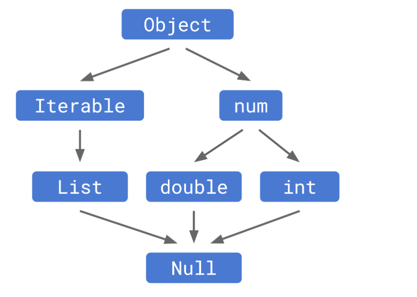
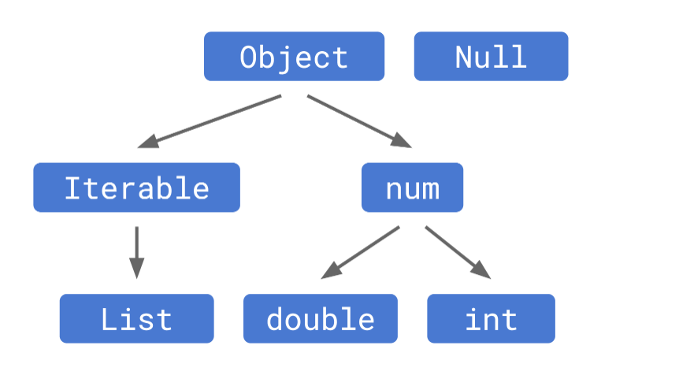
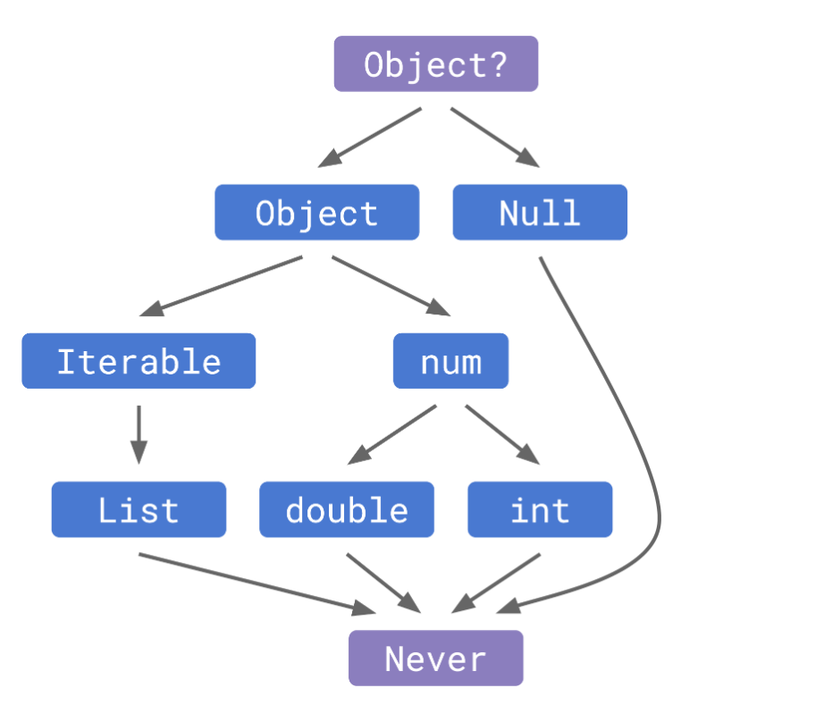

## Flutter 2.0 空安全

- #### 类型系统中的可空性:

  - ##### 空安全之前

    静态类型系统允许所有类型的表达式中的每一处都可以有 `null`, 从类型理论的角度来说，`Null` 类型被看作是所有类型的子类. 但是 `null` 值并没有它们定义的任何一个方法(除了`toString` `hashCode`)。所以当 `null` 传递至其他类型的表达式时，任何操作都有可能失败。这就是空引用的症结所在——所有错误都来源于尝试在 `null` 上查找一个不存在的方法或属性。

  

  - ##### 空安全

    通过修改了类型的层级结构，从根源上解决了这个问题。 `Null` 类型仍然存在，但它不再是所有类型的子类。现在的类型层级是这样的

    

    现在所有类型默认设置为非空的, 所以无法将`null`值赋值给他们;

    除非定义一个组合类型, 类似 `String?`, 通过在类型后面加上`?`来实现, 其本质是 `String|Null `这样的组合类型的缩写
    
  - ##### 顶层及底层

    如果类型系统中有顶层和底层类型，将给我们带来一定程度的便利，因为它意味着像最小上界这样类型层面的操作（类型推理常根据一个条件表达式的两个分支推导出一个类型）一定能推导出一个类型。

    空安全之前顶层类型是`Object`, 底层类型是`Null`; 

    空安全之后顶层类型是`Object?`, 底层类型是`Never`

    **注意:** 

    - 如果您想表明让一个值可以接受任意类型，请用 `Object?` 而不是 `Object`。因为`Object`意味着是“除了 `null` 以外的任何实例”。
    - 在极少数需要底层类型的情况下，请使用 `Never` 代替 `Null`。如果您不了解是否需要一个底层类型，那么您基本上不会需要它。

  

- #### 确保正确性

  现在编译器更智能了, 他能判断空和非空了, 然后从容的去处理它们.

  - ##### 无效的返回值

    如果一个函数的返回类型非空，那么函数内最终一定要调用 `return` 返回一个值。在空安全引入以前，Dart 在限制未返回内容的函数时非常松懈。有了确定的非空类型，这段程序就是错误且不安全的。

    ```Dart
    String missingReturn() {
      // No return.
    }
    ```

  - ##### 未初始化的变量

    - **顶层变量和静态字段必须初始化**

      由于它们能在程序里的任何位置被访问到，编译器无法保证它们在被使用前已被赋值

      空安全下未初始化编译器会报错

    - **实例的字段也必须初始化，**

      可以为常见初始化形式，也可以在实例的构造方法中进行初始化

      空安全下未初始化编译器会报错

    - **局部变量灵活度最高**

      一个非空的变量 **不一定需要** 一个初始化方法, 但必须 **确保在使用前被赋值**

      空安全下未初始化编译器会报错

      ```dart
      // Using null safety:
      int tracingFibonacci(int n) {
        int result;
        if (n < 2) {
          result = n;
        } else {
          result = tracingFibonacci(n - 2) + tracingFibonacci(n - 1);
        }
      
        print(result);
        return result;
      }
      ```

      

